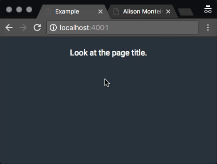

## change-title-onleave

> Change the tab title on change its visibility

# 

### Install

You can get it on npm/yarn.

```
npm install change-title-onleave --save
```

If you're not into package management, [download a ZIP file](https://github.com/alisonmonteiro/change-title-onleave/archive/master.zip).

### Usage

```html
<script src="change-title-onleave.min.js"></script>
```

Now, you need to instantiate it by passing an object as parameter;

```js
const options = {title: 'Hey! 👀', timeout: 1};
new ChangeTitleOnLeave(options);
```

You can also `require` it:

```js
const changeTitle = require('change-title-onleave');
```

### API

#### ChangeTitleOnLeave([options])

##### options

###### title

Type: `string`

A string with the title to apply on the tab

###### timeout

Type: `number`

Timeout between the transistion of titles

###### onHidden

Type: `function`

Is called when the user leaves the tab.

###### onVisible

Type: `function`

Is called when the user goes back to the tab.
